# Desktop mockups

Low-fidelity wireframes of the Australian FIRE Planner for **desktop web**.
They show one possible user flow and screen layout for the requirements in
[`../REQUIREMENTS.md`](../REQUIREMENTS.md).

- **The requirements take precedence.** The mockups illustrate the
  requirements and don't add to them. If a mockup and a requirement disagree,
  the requirement wins.
- **Wireframes, not visual design.** The mockups are greyscale on purpose, so
  review can focus on flow and content. Colours, typography and chart styling
  are still to be decided.
- **Blue tags** such as <code>IN-1</code> show which requirement each part of a
  screen covers.
- **Example data.** Every screen uses the same fictional couple, "Alex & Sam",
  so the figures line up across screens. The numbers are illustrative only.
- **Desktop only.** A mobile responsive design is in the backlog (BL-6).
- **Interactions a static image can't show:**
  - **Tables:** click any cell to edit it in place. Hover a row for its ⋯
    menu (Duplicate, Delete). See screen 02.
  - **Charts:** hovering shows a guide line and a tooltip with that year's
    values, and clicking opens the year in Year by year. See screen 03b.

## Screens

| # | Screen | Covers |
| --- | --- | --- |
| 00 | [User flow](00-user-flow.png) | How a user moves between the screens below |
| 01 | [Household](01-household.png) | IN-1 – IN-6 |
| 02 | [Income & expenses](02-income-expenses.png) | IN-7 – IN-9, EXP-1 – EXP-10 |
| 03a | [Assets: home you live in](03a-assets-home.png) | PROP-1 – PROP-13 (owner-occupied home, mortgage rate and type) |
| 03b | [Assets: share portfolio](03b-assets-shares.png) | IN-14 – IN-20, TAX-2, TAX-3 |
| 03c | [Assets: investment property](03c-assets-investment-property.png) | PROP-14 – PROP-17, TAX-5, TAX-6, FIRE-5 |
| 03d | [Assets: super, cash & debts](03d-assets-super-cash-debts.png) | IN-21 – IN-27, SUPER-1 – SUPER-9 |
| 04 | [Assumptions](04-assumptions.png) | IN-10 – IN-13, TAX-8, NFR-3 |
| 05 | [Results dashboard](05-results.png) | FIRE-1 – FIRE-7, COAST-1 – COAST-6, OUT-2, OUT-4, NFR-1 |
| 05b | [Inputs panel](05b-inputs-panel.png) | Editing any input from Results, Year by year or Scenarios without leaving the page |
| 06 | [Year by year](06-projection.png) | OUT-1 – OUT-3 (shown for a scenario with a bridge-period shortfall) |
| 07 | [Scenarios](07-scenarios.png) | OUT-5, OUT-6 |

### 00 · User flow
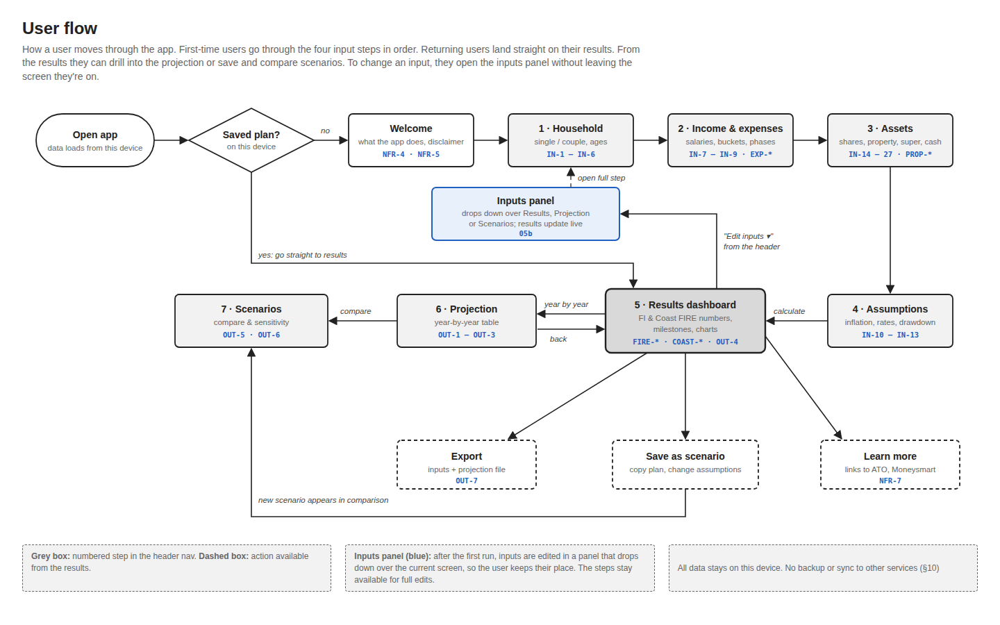

### 01 · Household
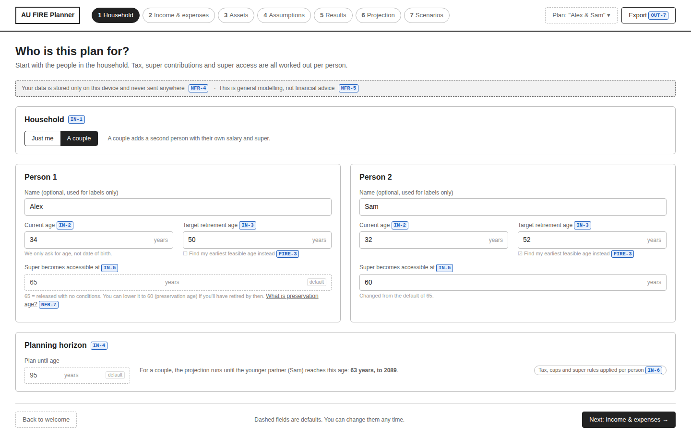

### 02 · Income & expenses
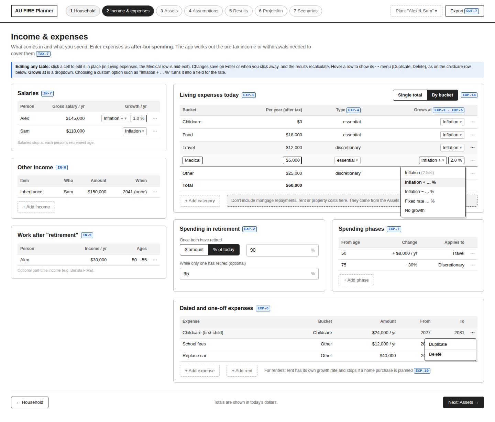

### 03a · Assets: home you live in
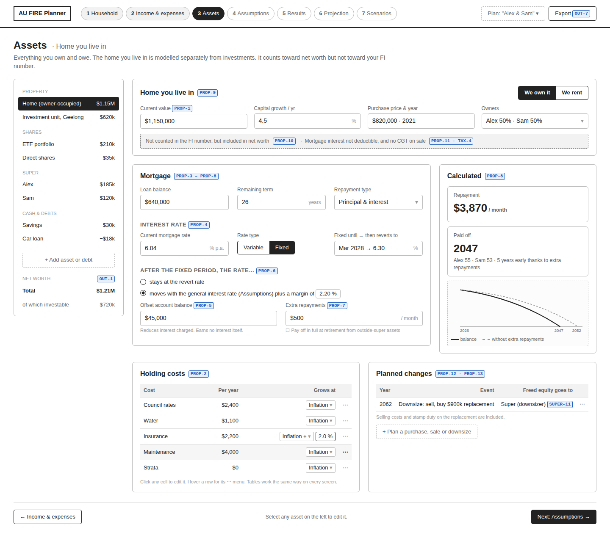

### 03b · Assets: share portfolio
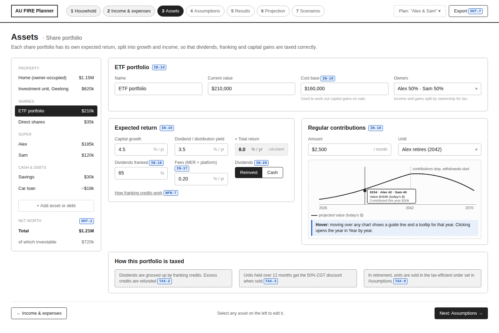

### 03c · Assets: investment property
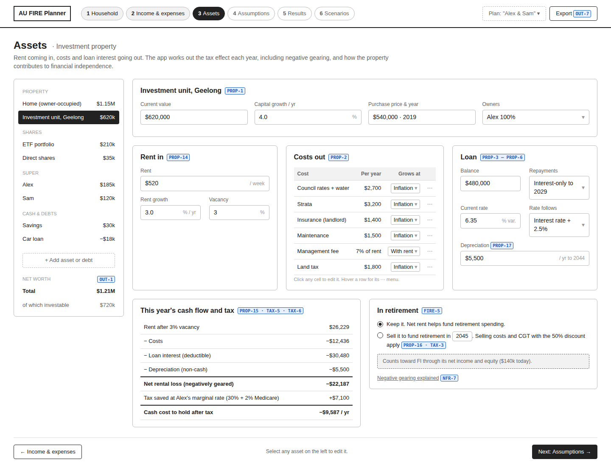

### 03d · Assets: super, cash & debts
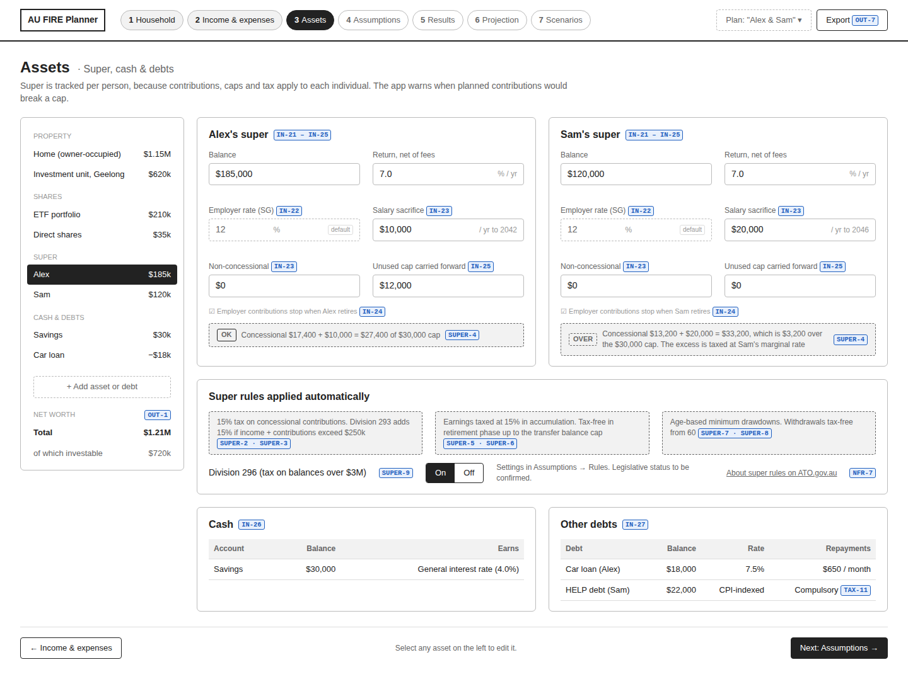

### 04 · Assumptions
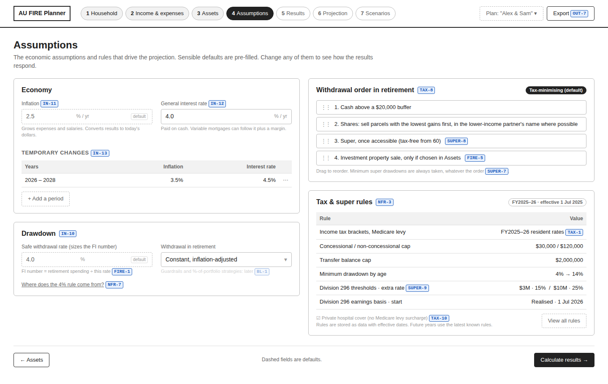

### 05 · Results dashboard
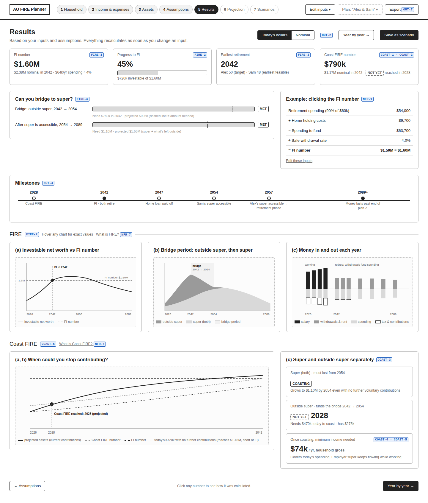

### 05b · Inputs panel
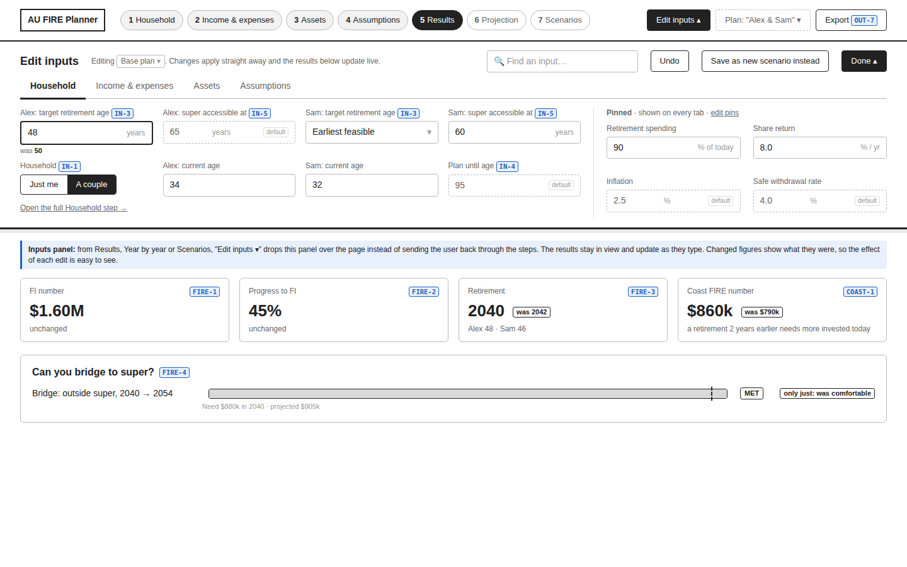

### 06 · Year by year
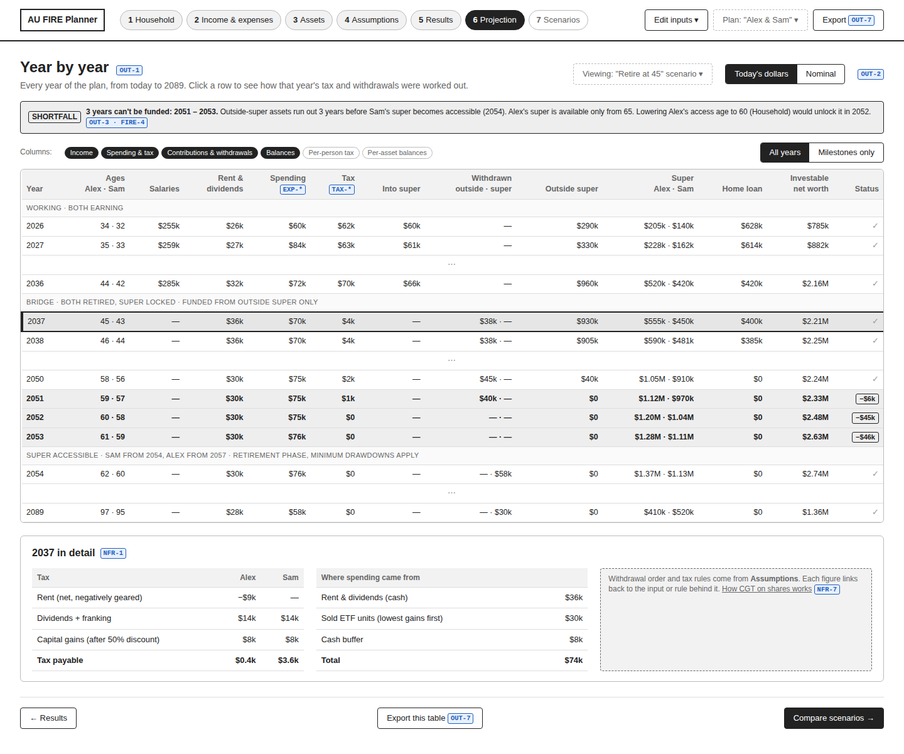

### 07 · Scenarios
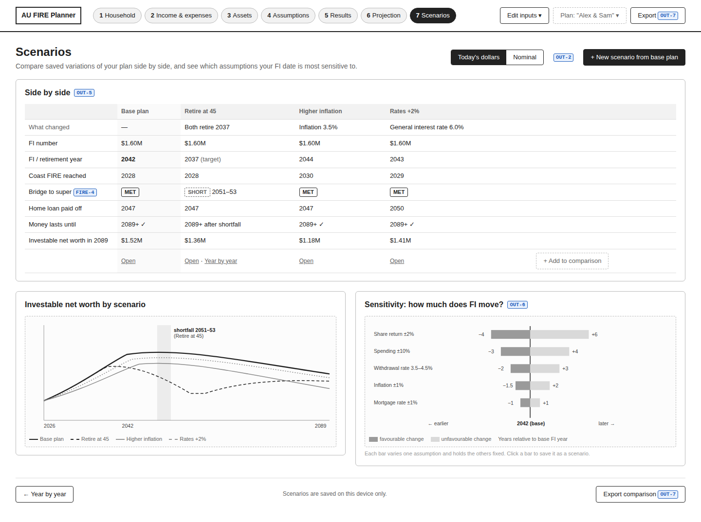

## Editing the mockups

The PNGs are rendered from the HTML files in [`src/`](src/):

| File | Purpose |
| --- | --- |
| `NN-*.html` | One file per screen |
| `wireframe.css` | Shared wireframe styles |
| `header.js` | Shared app header and step navigation |
| `assets-sidebar.js` | Shared asset list for the Assets screens (03a–03d) |
| `render.js` | Renders the HTML files to PNGs in this folder |

To re-render after editing, you need Node.js and
[Playwright](https://playwright.dev/) with Chromium:

```sh
npm install --no-save playwright   # once, if Playwright isn't installed
npx playwright install chromium    # once, if Chromium isn't installed
node requirements/mockups/src/render.js                  # all screens
node requirements/mockups/src/render.js 05-results.html  # one screen
```

Commit the updated PNGs together with the HTML changes, so the two stay in
sync.
